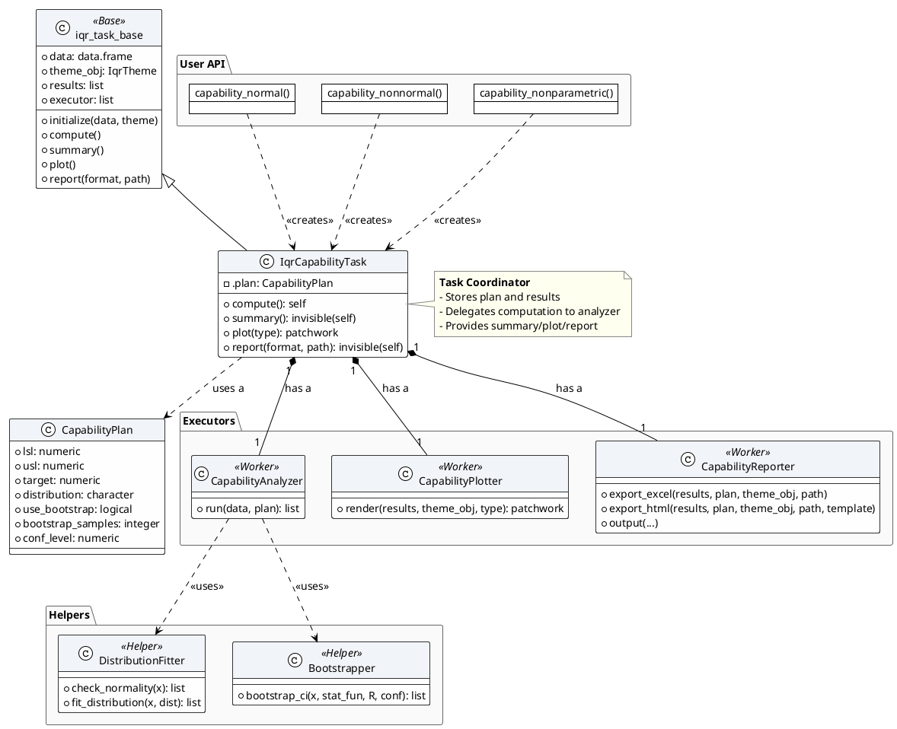

# iQualityR 过程能力分析 (CapabilityAnalysis) 开发需求文档 v5.0

## 1. 版本更新日志

| 版本 | 日期 | 更新内容 |
|------|------|----------|
| v5.0 | 2026-04-08 | 基于模板 v2.0 重构，统一接口、增加 Reporter 规范、整合子任务 |

## 2. 愿景与范围

### 2.1 目标
构建符合 AIAG MSA-4 / ISO 22514 标准的过程能力分析模块，支持正态、非正态、非参数三种场景，提供一致的计算、可视化和报告输出。

### 2.2 核心交付物

- **计划配置器** (`CapabilityPlan`): 存储分析参数（规格限、分布假设、Bootstrap 配置等）
- **协调器** (`IqrCapabilityTask`): 继承 `iqr_task_base`，实现 `compute()`, `summary()`, `plot()`, `report()`
- **执行器**:
  - `CapabilityAnalyzer`: 核心计算（正态/非正态/非参数分发）
  - `CapabilityPlotter`: 图表生成（直方图、QQ图、趋势图等）
  - `CapabilityReporter`: 报告导出（Excel + HTML）
- **辅助类**:
  - `DistributionFitter`: 分布拟合与正态性检验
  - `Bootstrapper`: Bootstrap 重采样与置信区间

### 2.3 支持标准
- AIAG MSA-4 第 4 版 (2024)
- ISO 22514 (过程能力与性能)
- ASTM E2587 (控制图)

### 2.4 功能列表

| 功能 | 描述 | 优先级 | 依赖 |
|------|------|--------|------|
| 正态能力分析 | Cp/Cpk, Pp/Ppk, 含 Sixpack 诊断 | P0 | 无 |
| 非正态能力分析 | 基于 Weibull/Lognormal/Gamma 分布 | P1 | 正态能力 |
| 非参数能力分析 | Bootstrap 置信区间、百分位数法 | P2 | 正态能力 |

## 3. UML 类图设计



## 4. 用户 API 设计

### 4.1 入口函数

| 函数签名 | 用途 | task_tag | 优先级 |
|----------|------|----------|--------|
| `capability_normal(data, measurement, lsl, usl, target = NULL, sixpack = FALSE, ...)` | 正态能力分析 | `capability_normal` | P0 |
| `capability_nonnormal(data, measurement, lsl, usl, distribution = "auto", ...)` | 非正态能力分析 | `capability_nonnormal` | P1 |
| `capability_nonparametric(data, measurement, lsl, usl, method = "percentile", R = 1000, ...)` | 非参数能力分析 | `capability_nonparametric` | P2 |

### 4.2 工作流示例

```r
# 正态能力分析（基础）
task <- capability_normal(
  data = process_data,
  measurement = "diameter",
  lsl = 90,
  usl = 110,
  sixpack = TRUE
)
task$compute()  # 如果入口函数未自动计算
task$summary()
task$plot()
task$report(format = "html", path = "cap_report.html")

# 管道操作
process_data %>%
  capability_normal(measurement = "diameter", lsl = 90, usl = 110) %>%
  plot() %>%
  report(format = "excel")
```

## 5. 计划配置器 (CapabilityPlan)

### 5.1 字段定义

| 字段名 | 类型 | 默认值 | 描述 |
|--------|------|--------|------|
| `lsl` | numeric | NULL | 规格下限 |
| `usl` | numeric | NULL | 规格上限 |
| `target` | numeric | NULL | 目标值（用于 Cpm） |
| `distribution` | character | "normal" | 分布假设（"normal", "weibull", "lognormal", "gamma", "auto"） |
| `use_bootstrap` | logical | FALSE | 是否计算 Bootstrap 置信区间 |
| `bootstrap_samples` | integer | 1000 | Bootstrap 重采样次数 |
| `conf_level` | numeric | 0.95 | 置信水平 |
| `sixpack` | logical | FALSE | 是否生成 Sixpack 诊断图集 |

## 6. 执行器规范

### 6.1 CapabilityAnalyzer

**方法**: `run(data, plan)`

**输入**: 
- `data`: data.frame，包含测量值列
- `plan`: CapabilityPlan 对象

**输出结构**:

```r
list(
  # 能力指数
  indices = list(
    cp = numeric,
    cpk = numeric,
    pp = numeric,
    ppk = numeric,
    cpm = numeric  # 仅当提供 target 时
  ),
  # 过程参数估计
  parameters = list(
    mean = numeric,
    sd_within = numeric,
    sd_overall = numeric,
    distribution_fit = list(dist = "normal", params = list(mean, sd))
  ),
  # 预期缺陷率 (PPM)
  ppm = list(
    within = list(below_lsl = numeric, above_usl = numeric, total = numeric),
    overall = list(...)
  ),
  # 诊断信息
  diagnostics = list(
    normality_p_value = numeric,
    fit_gof = list(statistic, p_value),
    warnings = character
  ),
  # Bootstrap 结果（如果启用）
  bootstrap = list(
    cp_ci = c(lower, upper),
    cpk_ci = c(lower, upper),
    ...
  ),
  # 原始数据备份
  raw_data = data.frame(measurement = numeric)
)
```

### 6.2 CapabilityPlotter

**方法**: `render(results, theme_obj, type = "full")`

**支持的 `type`**:
- `"basic"`: 直方图 + 密度曲线 + 规格限
- `"qq"`: 正态 QQ 图（或对应分布的 QQ 图）
- `"full"`: 组合图（直方图、QQ图、能力条图、控制图如果 sixpack）

### 6.3 CapabilityReporter

**必须实现**:
- `export_excel()`: 导出能力指数表、PPM 表、诊断结果
- `export_html()`: 使用内置 Rmd 模板生成完整报告
- `output()`: 统一入口

## 7. 子任务列表

| 子任务 | 描述 | 优先级 | 需求文档 |
|--------|------|--------|----------|
| 正态能力分析 | Cp/Cpk, Pp/Ppk, Sixpack | P0 | 详见附录 A |
| 非正态能力分析 | 分布拟合 + 分位数法 | P1 | 详见附录 B |
| 非参数能力分析 | Bootstrap 置信区间 | P2 | 详见附录 C |

## 8. 判定标准 (AIAG / ISO 22514)

| 指标 | 可接受 | 条件接受 | 不可接受 |
|------|--------|----------|----------|
| Cp / Cpk | ≥ 1.33 | 1.00 – 1.33 | < 1.00 |
| Pp / Ppk | ≥ 1.33 | 1.00 – 1.33 | < 1.00 |
| 缺陷率 DPMO | < 3000 | 3000 – 10000 | > 10000 |

## 9. 竞品对标

| 功能 | Minitab 19 | JMP 2024 | iQualityR 目标 |
|------|-----------|----------|----------------|
| 正态能力分析 (Cp/Cpk) | ✓ | ✓ | ✓ (Phase 1) |
| Sixpack 诊断图 | ✓ | ✓ | ✓ |
| 非正态能力 (Weibull等) | ✓ | ✓ | ✓ (Phase 2) |
| Bootstrap 置信区间 | ✓ | ✓ | ✓ (Phase 3) |

## 10. 开发优先级

| Phase | 内容 | 预计工时 | 依赖 |
|-------|------|----------|------|
| Phase 1 | 正态能力分析 + Excel 报告 | 5 人天 | 无 |
| Phase 2 | 非正态能力分析 + 分布拟合 | 4 人天 | Phase 1 |
| Phase 3 | 非参数能力分析 + Bootstrap | 3 人天 | Phase 1 |

## 11. 参考资料

- AIAG MSA-4 (2024) Appendix C: Process Capability
- ISO 22514-1:2014 Statistical methods in process management — Capability and performance
- Montgomery, D.C. (2013). Introduction to Statistical Quality Control (7th ed.)

---

## 附录 A: 正态能力分析 (capability_normal) 需求文档

````markdown
---
name: 正态能力分析 (capability_normal) 开发需求 v1.0
description: 基于正态假设的过程能力指数计算与 Sixpack 诊断
type: sub_task
version: 1.0
date: 2026-04-08
status: 待评审
parent_task: 过程能力分析 (CapabilityAnalysis)
---

# iQualityR 正态能力分析 (capability_normal) 开发需求 v1.0

## 1. 基本信息

| 属性 | 内容 |
|------|------|
| 所属板块 | 过程能力分析 |
| 子任务标识 | `capability_normal` |
| 优先级 | P0 |
| 预计工时 | 5 人天 |
| 依赖任务 | 无 |

## 2. 功能概述

### 2.1 业务场景
当过程数据服从正态分布时，计算短期能力指数 (Cp/Cpk) 和长期能力指数 (Pp/Ppk)，并提供 Sixpack 诊断图集（直方图、概率图、控制图等）。

### 2.2 核心价值
- 快速评估过程是否满足规格要求
- 通过 Sixpack 一次性诊断过程稳定性和正态性
- 输出符合 AIAG 标准的报告

### 2.3 适用条件
- 数据近似正态分布（Shapiro-Wilk p > 0.05 为佳，但非强制）
- 至少 50 个测量值
- 规格限已明确

## 3. 用户 API

### 3.1 函数签名

```r
capability_normal(
  data,
  measurement,
  lsl,
  usl,
  target = NULL,
  subgroup = NULL,
  sixpack = FALSE,
  conf_level = 0.95,
  ...
)
```

### 3.2 参数说明

| 参数名 | 类型 | 必需 | 默认值 | 描述 |
|--------|------|------|--------|------|
| data | data.frame | 是 | - | 数据框 |
| measurement | character | 是 | - | 测量值列名 |
| lsl | numeric | 是 | - | 规格下限 |
| usl | numeric | 是 | - | 规格上限 |
| target | numeric | 否 | NULL | 目标值（用于 Cpm） |
| subgroup | character | 否 | NULL | 子组列名（用于计算组内标准差） |
| sixpack | logical | 否 | FALSE | 是否生成 Sixpack 诊断图 |
| conf_level | numeric | 否 | 0.95 | 置信水平 |

### 3.3 使用示例

```r
# 基础用法（无子组，使用整体标准差）
result <- capability_normal(
  data = piston_data,
  measurement = "diameter",
  lsl = 98,
  usl = 102
)
result$compute()
result$summary()

# 含子组（使用组内标准差）
result <- capability_normal(
  data = process_data,
  measurement = "value",
  lsl = 90,
  usl = 110,
  subgroup = "batch"
)

# Sixpack 诊断
result <- capability_normal(..., sixpack = TRUE)
result$plot(type = "full")
```

## 4. 数据结构

### 4.1 输入数据格式

```r
data.frame(
  value = c(101.2, 99.8, 100.5, ...),
  batch = c(1, 1, 1, 2, 2, ...)  # 可选
)
```

### 4.2 数据要求
- 测量值应为数值型，无缺失值（缺失值自动删除并警告）
- 样本量 ≥ 30（推荐 ≥ 100）
- 若有子组，每个子组样本量 ≥ 2

### 4.3 输出结果结构

参见板块文档 6.1 节。

## 5. 核心算法与统计量

### 5.1 能力指数定义

#### Cp (过程能力指数)

**定义**: 过程的潜在能力，不考虑偏移。

**公式**:
```
Cp = (USL - LSL) / (6 * σ_within)
```
其中 `σ_within` 为组内标准差（通过极差法或合并标准差估计）。

**参考来源**: AIAG MSA-4 Appendix C

#### Cpk (过程能力指数，考虑偏移)

**公式**:
```
Cpk = min(Cp_upper, Cp_lower)
Cp_upper = (USL - μ) / (3 * σ_within)
Cp_lower = (μ - LSL) / (3 * σ_within)
```

#### Pp / Ppk

使用整体标准差 `σ_overall` 替代组内标准差。

### 5.2 标准差估计

| 场景 | 方法 | 公式 |
|------|------|------|
| 有子组 | 极差法（推荐） | σ_within = R̄ / d2(n) |
| 有子组 | 合并标准差 | σ_within = sqrt(∑(n_i-1)s_i² / ∑(n_i-1)) |
| 无子组 | 整体标准差 | σ_overall = sd(x) |

**参考**: ASTM E2587, Montgomery Ch.6

### 5.3 Sixpack 诊断图集

当 `sixpack = TRUE` 时，`plot(type = "full")` 应输出：

1. **直方图** + 规格限 + 能力指数标注
2. **正态概率图** (QQ 图) + Shapiro-Wilk p 值
3. **控制图**: Xbar-R 或 I-MR（取决于有无子组）
4. **能力条图**: Cp/Cpk/Pp/Ppk 条形对比
5. **运行图**: 测量值按时间顺序的散点图

### 5.4 Minitab 比对验证

使用 Minitab 示例数据集 `Piston.MTW`（活塞直径）验证：

| 统计量 | Minitab 19 输出 | iQualityR 目标 | 允许误差 |
|--------|----------------|----------------|----------|
| Cp | 1.24 | 1.24 | ±0.01 |
| Cpk | 1.05 | 1.05 | ±0.01 |
| Pp | 1.20 | 1.20 | ±0.01 |
| Ppk | 1.02 | 1.02 | ±0.01 |

## 6. 绘图规范

### 6.1 图表类型

| 图表名称 | 类型 | 必需元素 | 适用场景 |
|----------|------|----------|----------|
| 能力直方图 | `plot_histogram` | 密度曲线、LSL/USL 垂直线、Cp/Cpk 标注 | 基础能力图 |
| 正态 QQ 图 | `plot_qq` | 45° 参考线、置信带 | 正态性诊断 |
| 能力条图 | `ggplot2::geom_col` | Cp/Cpk/Pp/Ppk 条形、参考线 1.33 | 指数对比 |

### 6.2 绘图代码示例（内部调用通用函数）

```r
# 在 CapabilityPlotter$render 中
if (type == "basic") {
  p_hist <- plot_histogram(
    data = results$raw_data,
    spec_limits = c(plan$lsl, plan$usl),
    theme_obj = theme_obj
  ) + labs(subtitle = sprintf("Cp = %.2f, Cpk = %.2f", results$indices$cp, results$indices$cpk))
  
  return(p_hist)
}
```

## 7. 判定标准

| 指标 | 可接受 | 条件接受 | 不可接受 |
|------|--------|----------|----------|
| Cpk | ≥ 1.33 | 1.00 – 1.33 | < 1.00 |
| Ppk | ≥ 1.33 | 1.00 – 1.33 | < 1.00 |

## 8. 报告模板

### 8.1 Excel 报告内容

| Sheet名称 | 内容 |
|-----------|------|
| Summary | 能力指数表、PPM 表 |
| Parameters | 过程均值、标准差估计 |
| Diagnostics | 正态性检验结果 |
| Raw_Data | 原始测量值 |

### 8.2 HTML 报告内容

- 执行摘要（Cpk 等级、结论）
- 能力直方图
- 正态 QQ 图
- 能力指数表
- 控制图（若 sixpack）
- 诊断说明

## 9. 测试用例

### 9.1 单元测试

```r
test_that("capability_normal returns correct indices", {
  set.seed(123)
  data <- data.frame(value = rnorm(100, mean = 100, sd = 2))
  task <- capability_normal(data, "value", lsl = 90, usl = 110)
  task$compute()
  
  expect_equal(round(task$results$indices$cp, 2), 1.67, tolerance = 0.02)
  expect_equal(round(task$results$indices$cpk, 2), 1.67, tolerance = 0.02)
})
```

### 9.2 Minitab 比对测试

```r
test_that("results match Minitab example", {
  # 使用内置示例数据 piston
  data(piston)
  task <- capability_normal(piston, "diameter", lsl = 98, usl = 102)
  task$compute()
  expect_equal(task$results$indices$cp, 1.24, tolerance = 0.01)
})
```

## 10. 竞品参考

### 10.1 Minitab 对应功能
- 菜单: Stat > Quality Tools > Capability Analysis > Normal
- 输出: 能力直方图、概率图、能力指数表、整体/组内 PPM

## 11. 参考资料

- Montgomery, D.C. (2013). Introduction to Statistical Quality Control, Chapter 8.
- AIAG MSA-4 (2024) Appendix C.
````

---

## 附录 B: 非正态能力分析 (capability_nonnormal) 需求文档

````markdown
---
name: 非正态能力分析 (capability_nonnormal) 开发需求 v1.0
description: 基于 Weibull/Lognormal/Gamma 等分布的非正态过程能力分析
type: sub_task
version: 1.0
date: 2026-04-08
status: 待评审
parent_task: 过程能力分析 (CapabilityAnalysis)
---

# iQualityR 非正态能力分析 (capability_nonnormal) 开发需求 v1.0

## 1. 基本信息

| 属性 | 内容 |
|------|------|
| 所属板块 | 过程能力分析 |
| 子任务标识 | `capability_nonnormal` |
| 优先级 | P1 |
| 预计工时 | 4 人天 |
| 依赖任务 | 正态能力分析 (Phase 1) |

## 2. 功能概述

### 2.1 业务场景
当过程数据显著偏离正态分布时，使用合适的分布（Weibull、Lognormal、Gamma）拟合数据，并基于分位数法计算能力指数。

### 2.2 核心价值
- 避免正态假设错误导致的能力指数误判
- 自动选择最优分布或用户指定
- 提供拟合优度检验

### 2.3 适用条件
- 数据非正态（Shapiro-Wilk p < 0.05）
- 样本量 ≥ 50

## 3. 用户 API

### 3.1 函数签名

```r
capability_nonnormal(
  data,
  measurement,
  lsl,
  usl,
  distribution = "auto",   # "weibull", "lognormal", "gamma", "auto"
  method = "percentile",    # "percentile", "transform"
  conf_level = 0.95,
  ...
)
```

### 3.2 参数说明

| 参数名 | 类型 | 必需 | 默认值 | 描述 |
|--------|------|------|--------|------|
| data | data.frame | 是 | - | 数据框 |
| measurement | character | 是 | - | 测量值列名 |
| lsl | numeric | 是 | - | 规格下限 |
| usl | numeric | 是 | - | 规格上限 |
| distribution | character | 否 | "auto" | 分布类型（"weibull", "lognormal", "gamma", "auto"） |
| method | character | 否 | "percentile" | 能力计算方法（分位数法或变换法） |

### 3.3 使用示例

```r
# 自动选择最优分布
result <- capability_nonnormal(
  data = thickness_data,
  measurement = "thick",
  lsl = 0.8,
  usl = 1.2,
  distribution = "auto"
)

# 指定 Weibull 分布
result <- capability_nonnormal(
  data = lifetime_data,
  measurement = "hours",
  lsl = 100,
  usl = 500,
  distribution = "weibull"
)
```

## 4. 数据结构

### 4.1 输入数据格式
同正态能力分析。

### 4.2 输出结果结构

```r
list(
  indices = list(
    pp = numeric,        # 基于分位数的性能指数
    ppk = numeric,
    cp = NA,             # 非正态一般不用 Cp
    cpk = NA
  ),
  parameters = list(
    distribution = "weibull",
    params = list(shape, scale),
    gof = list(ad_statistic, p_value)
  ),
  ppm = list(...),
  diagnostics = list(
    best_distribution = "weibull",
    aic = numeric,
    warnings = character
  ),
  raw_data = data.frame(...)
)
```

## 5. 核心算法

### 5.1 分布拟合

使用 `fitdistrplus` 包进行最大似然估计：

```r
fit <- fitdist(data, distr = "weibull")  # 或 "lnorm", "gamma"
```

**自动选择**: 计算 AIC，选择最小值对应的分布。

### 5.2 分位数法能力指数

```
Pp = (USL - LSL) / (p(0.99865) - p(0.00135))
Ppk = min( (USL - median) / (p(0.99865) - median), 
           (median - LSL) / (median - p(0.00135)) )
```
其中 `p(q)` 为拟合分布的 q 分位数。

**参考**: ISO 22514-4:2016

### 5.3 变换法（备选）

若用户选择 `method = "transform"`，则对数据应用 Box-Cox 或 Johnson 变换，变换后使用正态能力公式，并反变换规格限。

## 6. 绘图规范

| 图表名称 | 类型 | 必需元素 |
|----------|------|----------|
| 拟合分布直方图 | 直方图 + 拟合密度曲线 | 拟合曲线、规格限 |
| 分位数-分位数图 | QQ 图（针对所选分布） | 理论分位数 vs 实际分位数 |
| 能力条图 | 柱状图 | Pp, Ppk |

## 7. 判定标准

同正态能力分析，但使用 Pp/Ppk 替代 Cp/Cpk。

## 8. 测试用例

```r
test_that("Weibull fit returns reasonable indices", {
  set.seed(123)
  data <- data.frame(value = rweibull(100, shape = 2, scale = 10))
  task <- capability_nonnormal(data, "value", lsl = 2, usl = 18, distribution = "weibull")
  task$compute()
  expect_true(task$results$indices$pp > 0)
})
```

## 9. 参考资料

- ISO 22514-4:2016 (Process capability estimates for non-normal distributions)
- Cleveland, W.S. (1993). Visualizing Data.
````

---

## 附录 C: 非参数能力分析 (capability_nonparametric) 需求文档

````markdown
---
name: 非参数能力分析 (capability_nonparametric) 开发需求 v1.0
description: 基于 Bootstrap 和百分位数法的非参数能力分析
type: sub_task
version: 1.0
date: 2026-04-08
status: 待评审
parent_task: 过程能力分析 (CapabilityAnalysis)
---

# iQualityR 非参数能力分析 (capability_nonparametric) 开发需求 v1.0

## 1. 基本信息

| 属性 | 内容 |
|------|------|
| 所属板块 | 过程能力分析 |
| 子任务标识 | `capability_nonparametric` |
| 优先级 | P2 |
| 预计工时 | 3 人天 |
| 依赖任务 | 正态能力分析 (Phase 1) |

## 2. 功能概述

### 2.1 业务场景
当数据无法用任何常见参数分布拟合时，使用百分位数法或 Bootstrap 重采样估计能力指数及其置信区间。

### 2.2 核心价值
- 不依赖任何分布假设
- 提供能力指数的置信区间，量化估计不确定性
- 适用于任意形状的数据

### 2.3 适用条件
- 样本量 ≥ 100（Bootstrap 要求较大样本）
- 数据不满足任何参数分布

## 3. 用户 API

### 3.1 函数签名

```r
capability_nonparametric(
  data,
  measurement,
  lsl,
  usl,
  method = "percentile",   # "percentile", "bootstrap"
  R = 1000,                # Bootstrap 重采样次数
  conf_level = 0.95,
  ...
)
```

### 3.2 使用示例

```r
# 百分位数法
result <- capability_nonparametric(
  data = irregular_data,
  measurement = "value",
  lsl = 50,
  usl = 150,
  method = "percentile"
)

# Bootstrap 置信区间
result <- capability_nonparametric(
  data = irregular_data,
  measurement = "value",
  lsl = 50,
  usl = 150,
  method = "bootstrap",
  R = 2000
)
```

## 4. 核心算法

### 4.1 百分位数法

直接使用样本分位数替代分布分位数：

```
Pp_nonparam = (USL - LSL) / (Q(0.99865) - Q(0.00135))
```
其中 `Q(p)` 为样本的 p 分位数（使用类型 7，与 R 默认一致）。

### 4.2 Bootstrap 置信区间

1. 从原始数据有放回重采样 R 次，每次样本量等于原始样本量
2. 每次计算 Pp 和 Ppk
3. 取 2.5% 和 97.5% 分位数作为置信区间

## 5. 绘图规范

| 图表名称 | 类型 | 必需元素 |
|----------|------|----------|
| Bootstrap 直方图 | 直方图 + 置信区间阴影 | 原始估计值标记 |
| 百分位区间图 | 误差棒图 | LSL, USL, 中位数, 0.135% / 99.865% 分位数 |

## 6. 判定标准

同正态能力分析，使用 Pp/Ppk。

## 7. 测试用例

```r
test_that("bootstrap returns CI", {
  set.seed(123)
  data <- data.frame(value = rnorm(100, 100, 5))
  task <- capability_nonparametric(data, "value", lsl = 85, usl = 115, 
                                   method = "bootstrap", R = 200)
  task$compute()
  expect_length(task$results$bootstrap$cpk_ci, 2)
})
```

## 8. 参考资料

- Efron, B., & Tibshirani, R.J. (1993). An Introduction to the Bootstrap.
- ISO 22514-6:2013 (Multivariate and non‑parametric capability statistics)
````

---

*文档版本: 5.0 | 最后更新: 2026-04-08 | 状态: 待评审*